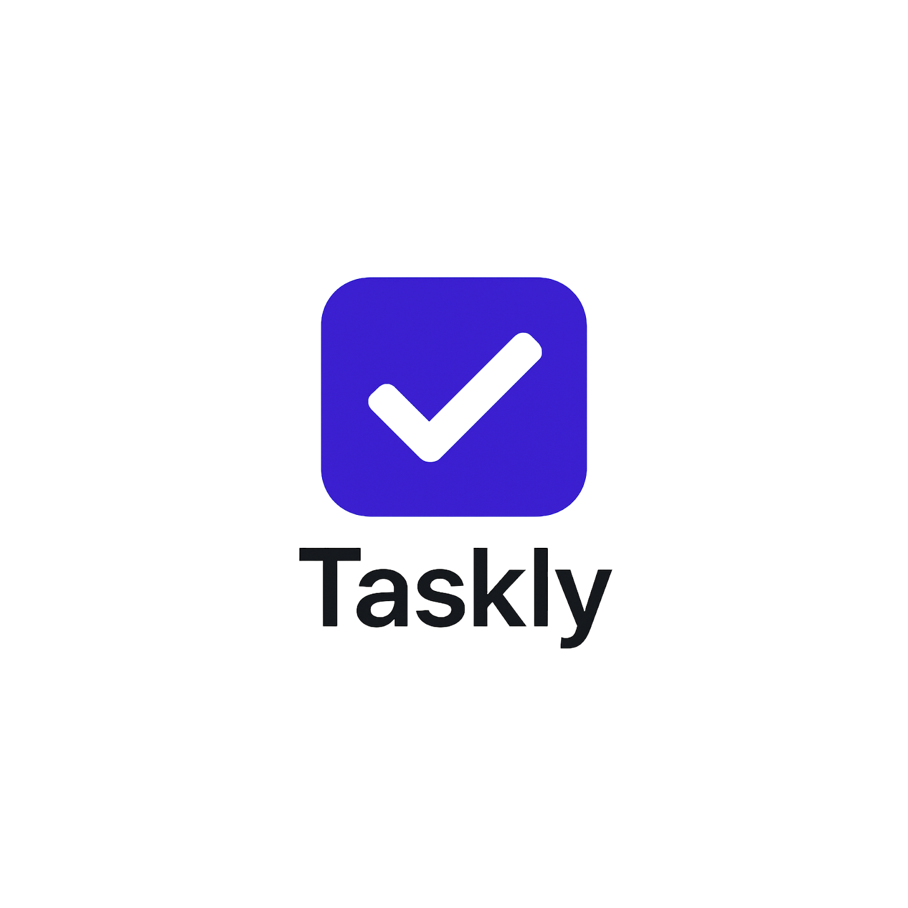

# Taskly - Modern Todo Uygulaması

<p align="center">
  
</p>

<p align="center">
  <b>Hayatınızı düzenleyin, zamanınızı yönetin!</b>
</p>

## 📱 Uygulama Hakkında

Taskly, günlük görevlerinizi, projelerinizi ve yapılacaklar listenizi kolayca yönetmenizi sağlayan modern ve kullanıcı dostu bir görev yönetim uygulamasıdır. Flutter ile geliştirilmiş, Firebase altyapısını kullanan bu uygulama, görevlerinizi kategorilere ayırmanıza, öncelik belirlemenize ve hatırlatıcılar ayarlamanıza olanak tanır.

## ✨ Özellikler

- **Modern Arayüz**: Kullanımı kolay, şık tasarım
- **Kategori Sistemi**: Görevlerinizi iş, kişisel, alışveriş, eğitim, sağlık ve diğer kategorilere ayırın
- **Öncelik Seviyeleri**: Önemli görevlerinizi vurgulayın
- **Bildirim Hatırlatıcıları**: Görevlerinizi asla unutmayın
- **Tarih Planlama**: Son tarihleri belirleyin ve takip edin
- **Karanlık Mod**: Gözlerinizi koruyun, gece de rahatça kullanın
- **Firebase Entegrasyonu**: Verileriniz güvenle bulutta saklanır
- **Kullanıcı Kimlik Doğrulama**: Güvenli giriş ve kayıt sistemi

## 🛠️ Teknolojiler

- **Flutter**: UI geliştirme
- **GetX**: Durum yönetimi
- **Firebase**: Veritabanı ve kimlik doğrulama
- **Cloud Firestore**: Veri saklama
- **Firebase Auth**: Kullanıcı yönetimi
- **Flutter Local Notifications**: Bildirim sistemi

## 📥 Kurulum

1. Projeyi klonlayın:
```bash
git clone https://github.com/ozcann159/Taskly.git